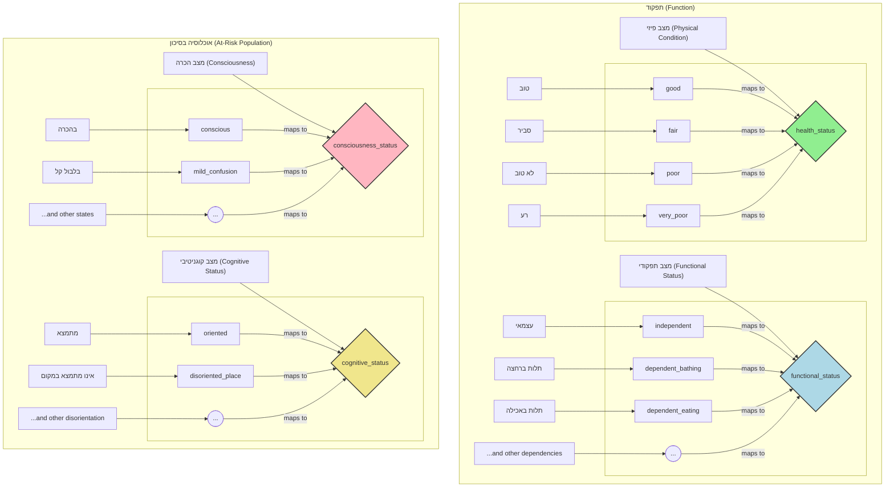
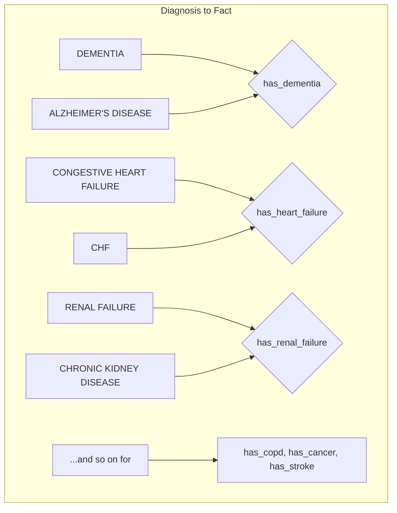
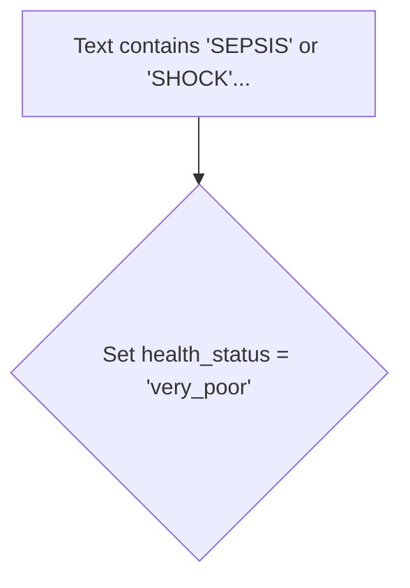
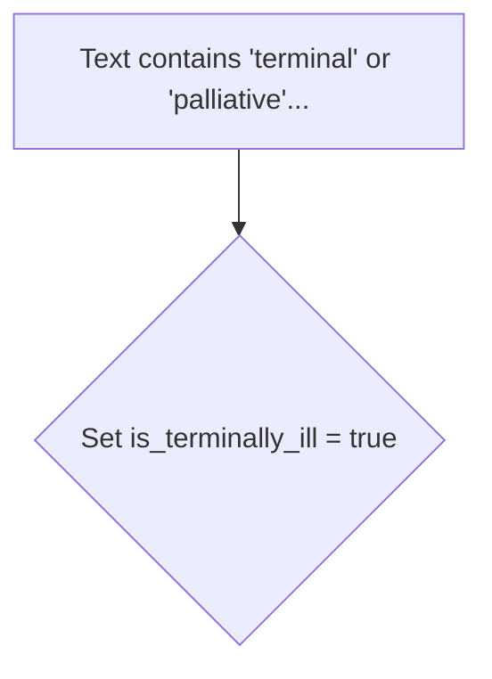
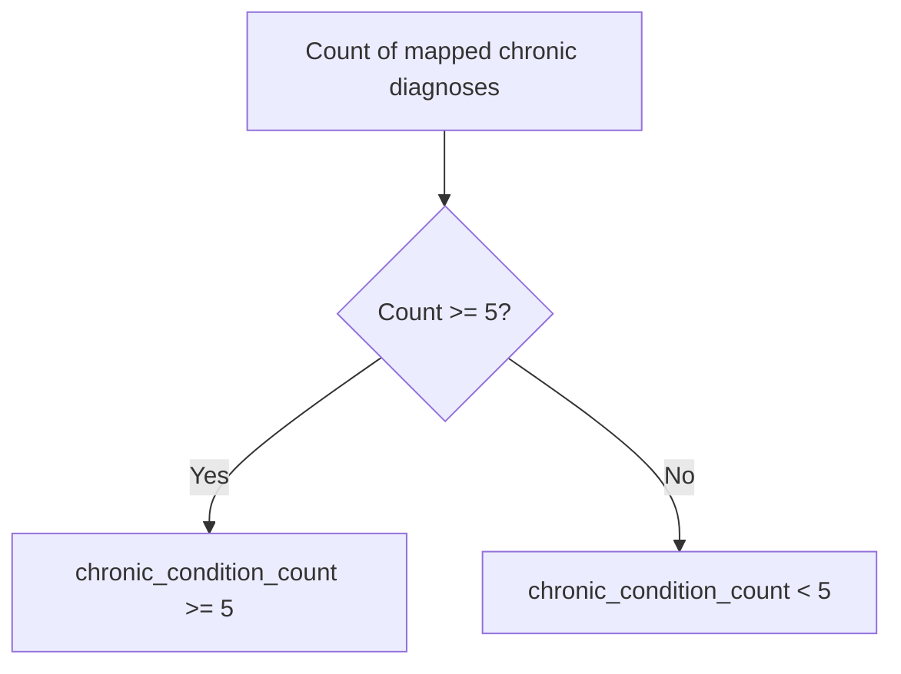

# Clinical Frailty Scale (CFS) Fact Mappings

This document visualizes the mappings from source data (in Hebrew) to the standardized facts used by the rule engine, as defined in `cfs_fact.json`.

## Fact Mapping (`FACT_MAPPING`)

This section shows how raw observations from different assessment categories are translated into standardized `functional_status`, `health_status`, `symptoms`, `cognitive_status`, and `consciousness_status` facts.

## Diagnosis Mapping (`DIAGNOSIS_MAPPING`)

This section shows how specific diagnosis codes/descriptions are mapped to boolean facts like `has_dementia` or `has_cancer`.

## Keyword-Based Facts

These facts are derived by searching for specific keywords in relevant text fields.

### Acute Diagnosis Keywords

- **Purpose**: Identifies acute conditions that may indicate a `very_poor` health status.
- **Keywords**: `SEPSIS`, `SHOCK`, `ACUTE RENAL FAILURE`, etc.

### Terminal Illness Keywords

- **Purpose**: Identifies if a patient is terminally ill.
- **Keywords**: `terminal`, `palliative`, `hospice`, `end-stage`.

## Thresholds

### Chronic Disease Threshold

- **Purpose**: Used to count the number of chronic conditions to determine `chronic_condition_count`.
- **Threshold**: A patient is considered to have a significant chronic disease burden if they have **5 or more** mapped chronic diseases. This count is then used in the CFS 4 rule.

