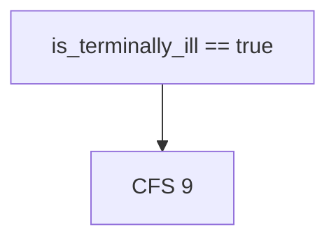
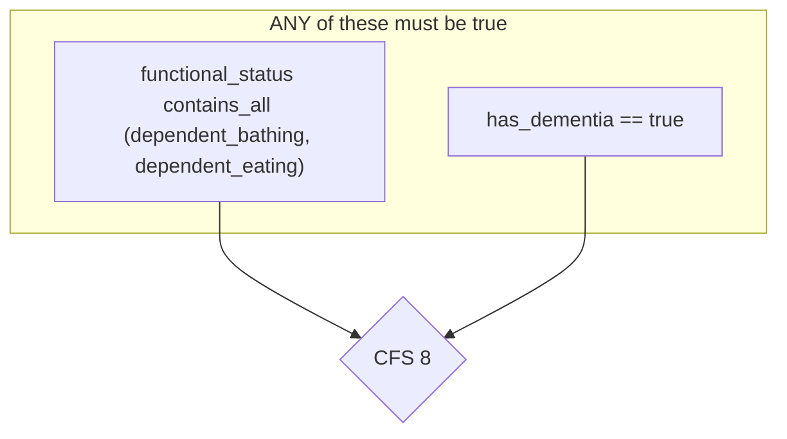
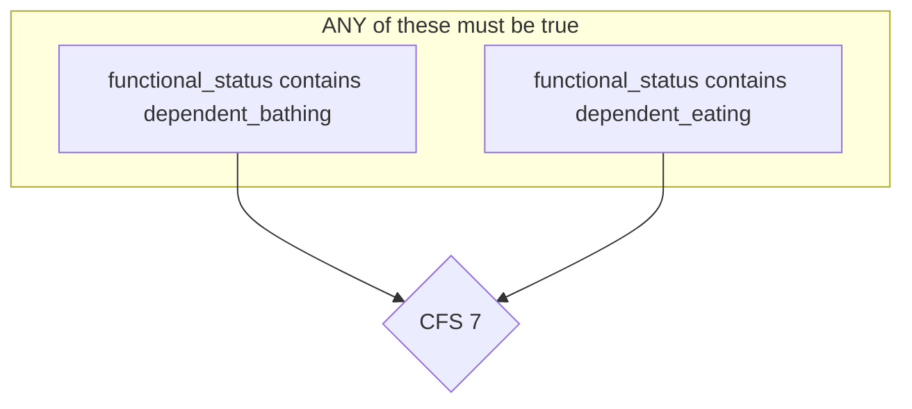
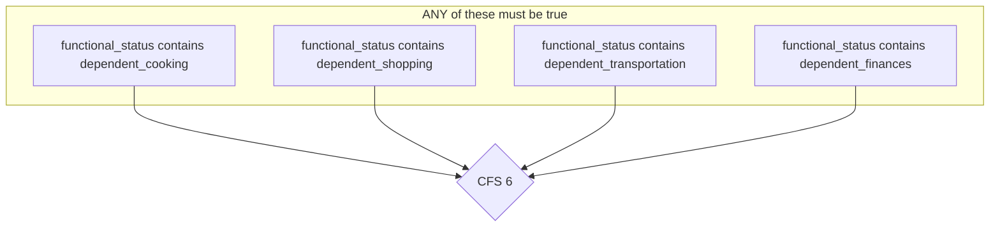
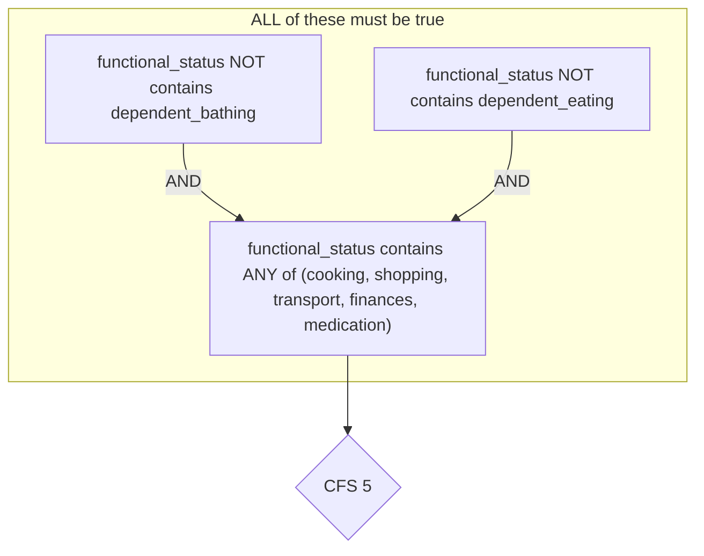
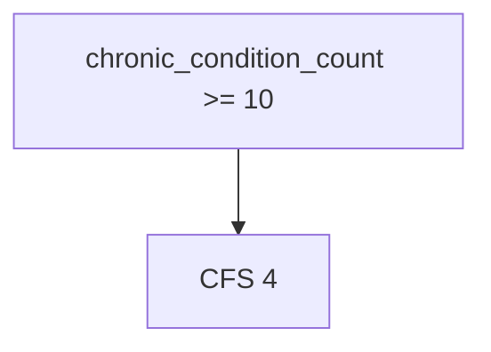
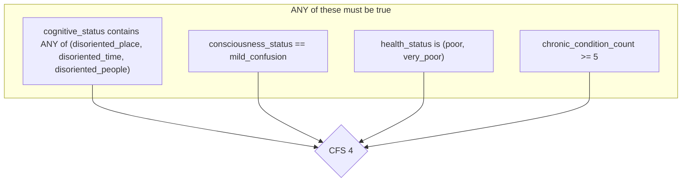
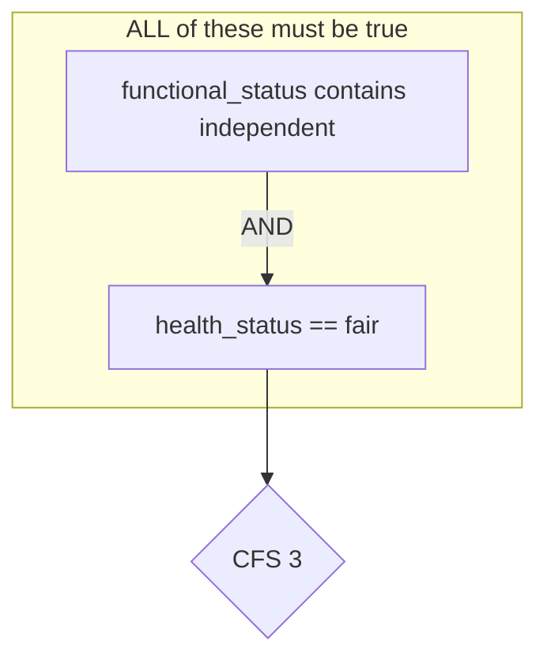
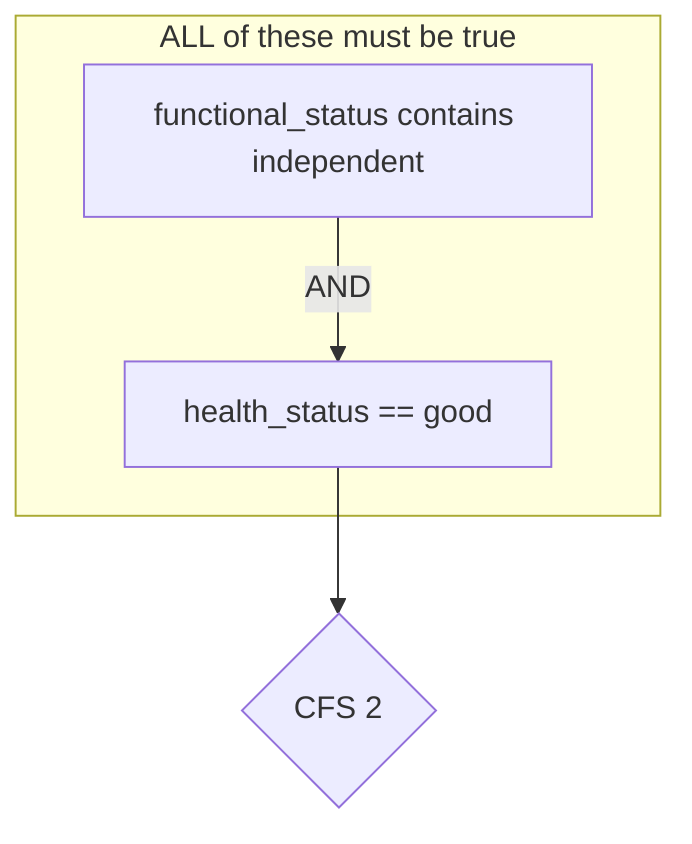
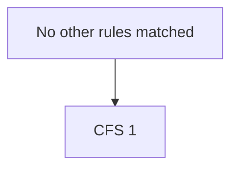

# Clinical Frailty Scale (CFS) Rules

This document visualizes the business logic for determining the Clinical Frailty Scale (CFS) score based on the rules defined in `cfs_rules.json`.

## Rule Evaluation Flow

The rules are evaluated sequentially based on their priority. The first rule that matches the patient's facts determines the CFS score. If no specific rule matches, the patient is assigned the default score of CFS 1.

```mermaid
graph TD
    subgraph "Evaluation Flow"
        direction LR
        A[Start] --> R1{"Priority 1: CFS 9?"};
        R1 -- No --> R2{"Priority 2: CFS 8?"};
        R2 -- No --> R3{"Priority 3: CFS 7?"};
        R3 -- No --> R4{"Priority 4: CFS 6?"};
        R4 -- No --> R5{"Priority 5: CFS 5?"};
        R5 -- No --> R6{"Priority 6: CFS 4?"};
        R6 -- No --> R7{"Priority 7: CFS 4?"};
        R7 -- No --> R8{"Priority 8: CFS 3?"};
        R8 -- No --> R9{"Priority 9: CFS 2?"};
        R9 -- No --> F_DEF[CFS 1 (Default)];
        
        R1 -- Yes --> F9[CFS 9];
        R2 -- Yes --> F8[CFS 8];
        R3 -- Yes --> F7[CFS 7];
        R4 -- Yes --> F6[CFS 6];
        R5 -- Yes --> F5[CFS 5];
        R6 -- Yes --> F4[CFS 4];
        R7 -- Yes --> F4;
        R8 -- Yes --> F3[CFS 3];
        R9 -- Yes --> F2[CFS 2];
    end

    style F9 fill:#c00,stroke:#333,stroke-width:2px,color:#fff
    style F8 fill:#ff4500,stroke:#333,stroke-width:2px,color:#fff
    style F7 fill:#ff8c00,stroke:#333,stroke-width:2px,color:#fff
    style F6 fill:#ffd700,stroke:#333,stroke-width:2px,color:#000
    style F5 fill:#f0e68c,stroke:#333,stroke-width:2px,color:#000
    style F4 fill:#add8e6,stroke:#333,stroke-width:2px,color:#000
    style F3 fill:#90ee90,stroke:#333,stroke-width:2px,color:#000
    style F2 fill:#3cb371,stroke:#333,stroke-width:2px,color:#fff
    style F_DEF fill:#2e8b57,stroke:#333,stroke-width:2px,color:#fff
```

## Rule Details

Here are the detailed conditions for each rule.

### CFS 9: Terminally Ill

- **Priority**: 1
- **Result**: Score 9



### CFS 8: Totally Dependent or Severe Dementia

- **Priority**: 2
- **Result**: Score 8



### CFS 7: Severely Frail (Dependent in Personal Care)

- **Priority**: 3
- **Result**: Score 7



### CFS 6: Moderately Frail (Dependent in IADLs)

- **Priority**: 4
- **Result**: Score 6



### CFS 5: Mildly Frail (Needs help with complex tasks)

- **Priority**: 5
- **Result**: Score 5



### CFS 4: Vulnerable

There are two rules that can result in a CFS score of 4.

#### Rule 1: Major Chronic Conditions

- **Priority**: 6
- **Result**: Score 4



#### Rule 2: Cognitive, Health, or Comorbidity Burden

- **Priority**: 7
- **Result**: Score 4



### CFS 3: Managing Well

- **Priority**: 8
- **Result**: Score 3



### CFS 2: Fit

- **Priority**: 9
- **Result**: Score 2



### CFS 1: Very Fit (Default)

- **Priority**: 99
- **Result**: Score 1
- **Condition**: This is the default rule and applies if no other rule conditions are met.


