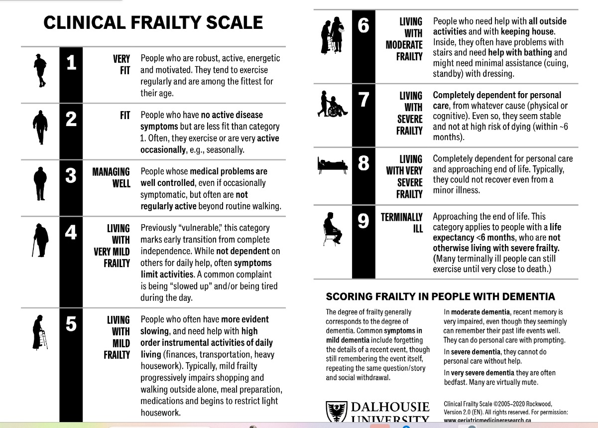
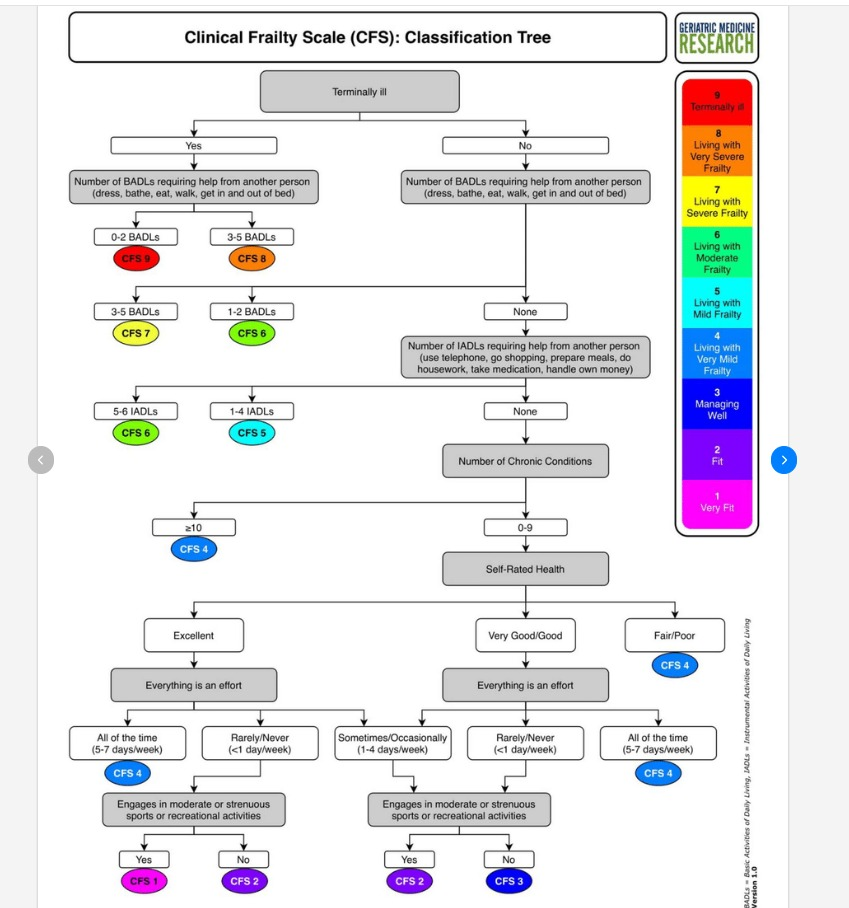

# Clinical Frailty Scale (CFS) Calculation Engine

This project implements a rule-based engine in Python to automatically calculate the Clinical Frailty Scale (CFS) for patients based on data from two main sources: `Cleaned_Assessment.csv` and `Diagnosis.csv`.




## How It Works

The system uses a decoupled architecture where the logic is separated from the data processing engine.

- **`cfs_rule_engine.py`**: This is the core script that contains the rule engine logic. It loads patient data, gathers "facts" about each patient, evaluates these facts against a set of rules, and writes the results to a CSV file.
- **`cfs_rules.json`**: This file defines the clinical logic for assigning a CFS score. It contains a list of rules, each with a priority, a set of conditions, and a resulting CFS score and description. The engine processes rules in order of priority.
- **`cfs_fact.json`**: This file serves as a data dictionary, mapping the raw data from the source CSVs (which includes Hebrew strings) into a standardized set of English "facts" that the rule engine can understand.

### Execution Flow

1. **Load Data**: The script loads the assessment and diagnosis data from the CSV files.
2. **Load Definitions**: The rules from `cfs_rules.json` and fact mappings from `cfs_fact.json` are loaded.
3. **Process Patients**: For each unique patient, the script performs the following:
    a. **Fact Gathering**: The `get_patient_facts` function gathers all available information for a patient and translates it into a standardized `facts` dictionary using the mappings in `cfs_fact.json`. This includes a special tiered logic to infer a patient's health status if it's not explicitly stated.
    b. **Rule Evaluation**: The `evaluate_rules` function takes the patient's `facts` and checks them against the list of rules, starting with the highest priority (lowest number).
    c. **Assign Score**: The first rule that matches the patient's facts determines their CFS score.
4. **Save Results**: The final CFS scores, along with all the facts used for the calculation, are saved to `CFS_Results.csv`.

## Running the Script

To run the calculation, execute the following command in a terminal with the appropriate Python environment activated:

```bash
python cfs_rule_engine.py
```

## Clinical Frailty Scale (CFS) Implementation

The CFS score is determined by a set of prioritized rules. The engine checks the rules in order, and the first rule that matches all its conditions determines the score.

- **CFS 9: Terminally Ill**
  - **Priority**: 1
  - **Condition**: The patient is identified as terminally ill (based on keywords like "terminal", "palliative", "hospice").

- **CFS 8: Totally Dependent or Severe Dementia**
  - **Priority**: 2
  - **Condition**: The patient is dependent in both bathing AND eating, OR has a diagnosis of Dementia.

- **CFS 7: Severely Frail**
  - **Priority**: 3
  - **Condition**: The patient is dependent in bathing OR eating.

- **CFS 6: Moderately Frail**
  - **Priority**: 4
  - **Condition**: The patient needs help with any instrumental activities of daily living (IADLs) like cooking, shopping, transportation, or managing finances.

- **CFS 5: Mildly Frail**
  - **Priority**: 5
  - **Condition**: The patient is NOT dependent in personal care (bathing, eating) but needs help with more complex tasks (IADLs or managing medication).

- **CFS 4: Vulnerable**
  - **Priority**: 6 & 7 (two rules can lead to this score)
  - **Conditions**:
    - Patient has 10 or more chronic conditions.
    - OR, patient has 5 or more chronic conditions, OR is disoriented, OR has mild confusion, OR has a "poor" or "very_poor" health status.

- **CFS 3: Managing Well**
  - **Priority**: 8
  - **Condition**: The patient is independent and has a "fair" health status.

- **CFS 2: Fit**
  - **Priority**: 9
  - **Condition**: The patient is independent and has a "good" health_status.

- **CFS 1: Very Fit**
  - **Priority**: 99 (Default)
  - **Condition**: This is the fallback rule. If no other conditions are met, the patient is considered very fit.

## Data Mapping Details

This section details the exact string mappings from the source files to the facts used by the engine, as defined in `cfs_fact.json`.

### Assessment Data Mapping

This maps the combination of `Description`, `Question_Name`, and `Answer_Text` from `Cleaned_Assessment.csv` to standardized facts.

| Description | Question_Name | Answer_Text | Fact Generated |
| :--- | :--- | :--- | :--- |
| `תפקוד` | `מצב תפקודי` | `עצמאי` | `functional_status: independent` |
| `תפקוד` | `מצב תפקודי` | `תלות ברחצה` | `functional_status: dependent_bathing` |
| `תפקוד` | `מצב תפקודי` | `תלות באכילה` | `functional_status: dependent_eating` |
| `תפקוד` | `מצב תפקודי` | `תלות בהכנת אוכל/בישול` | `functional_status: dependent_cooking` |
| `תפקוד` | `מצב תפקודי` | `תלות בקניות` | `functional_status: dependent_shopping` |
| `תפקוד` | `מצב תפקודי` | `תלות בהסעות` | `functional_status: dependent_transportation` |
| `תפקוד` | `מצב תפקודי` | `תלות בלקיחת תרופות` | `functional_status: dependent_medication` |
| `תפקוד` | `מצב תפקודי` | `תלות בטיפול בכספים` | `functional_status: dependent_finances` |
| `תפקוד` | `מצב פיזי` | `טוב` | `health_status: good` |
| `תפקוד` | `מצב פיזי` | `סביר` | `health_status: fair` |
| `תפקוד` | `מצב פיזי` | `לא טוב` | `health_status: poor` |
| `תפקוד` | `מצב פיזי` | `רע` | `health_status: very_poor` |
| `נשימה` | `קוצר נשימה` | `כן` | `symptoms: shortness_of_breath` |
| `כאב` | `כאב` | `כן` | `symptoms: has_pain` |
| `אוכלוסיה בסיכון` | `מצב קוגניטיבי` | `אינו מתמצא במקום` | `cognitive_status: disoriented_place` |
| `אוכלוסיה בסיכון` | `מצב קוגניטיבי` | `אינו מתמצא בזמן` | `cognitive_status: disoriented_time` |
| `אוכלוסיה בסיכון` | `מצב קוגניטיבי` | `אינו מתמצא באנשים` | `cognitive_status: disoriented_people` |
| `אוכלוסיה בסיכון` | `מצב הכרה` | `בלבול קל` | `consciousness_status: mild_confusion` |

*(Note: Other similar mappings for `health_status` under different `Description` categories like `הזנה` also exist.)*

### Health Status Inference Logic

Due to missing data, `health_status` is inferred using a 3-tiered approach if not explicitly found in the assessment data:

1. **Tier 1: Explicit Assessment**: Use the value from the assessment data if available.
2. **Tier 2: Acute Diagnoses**: If status is still unknown, check for severe acute diagnoses from `Diagnosis.csv`. If any of the following keywords are found, status is set to **`very_poor`**:
    - `SEPSIS`
    - `SHOCK`
    - `ACUTE RENAL FAILURE`
    - `RENAL FAILURE ACUTE`
    - `PNEUMONIA`
    - `PULMONARY EMBOLISM`
3. **Tier 3: Symptoms**: If status is still unknown, check for symptoms from the assessment data.
    - If `shortness_of_breath` is present, status is set to **`poor`**.
    - If `has_pain` is present, status is set to **`fair`**.

### Diagnosis & Keyword Mapping

The following keywords in the `Name` column of `Diagnosis.csv` are used to identify specific conditions.

- **Dementia**: `DEMENTIA`, `ALZHEIMER'S DISEASE`
- **Heart Failure**: `CONGESTIVE HEART FAILURE`, `CHF`
- **Renal Failure**: `RENAL FAILURE`, `CHRONIC KIDNEY DISEASE`
- **COPD**: `COPD`, `CHRONIC OBSTRUCTIVE PULMONARY DISEASE`
- **Cancer**: `CANCER`, `MALIGNANCY`, `LYMPHOMA`, `LEUKEMIA`
- **Stroke**: `CEREBROVASCULAR ACCIDENT`, `CVA`, `STROKE`
- **Terminal Illness**: `terminal`, `palliative`, `hospice`, `end-stage`

## Output File

The script generates `CFS_Results.csv` with the following key columns:

- `PatientNum`: The patient's unique identifier.
- `CFS_Score`: The calculated CFS score.
- `CFS_Description`: The description of the calculated score.
- `Matched_Rule_Priority`: The priority of the rule that was triggered.
- `Matched_Rule_Name`: The name of the rule that was triggered.
- Additional columns for every fact used in the calculation, providing full transparency.
