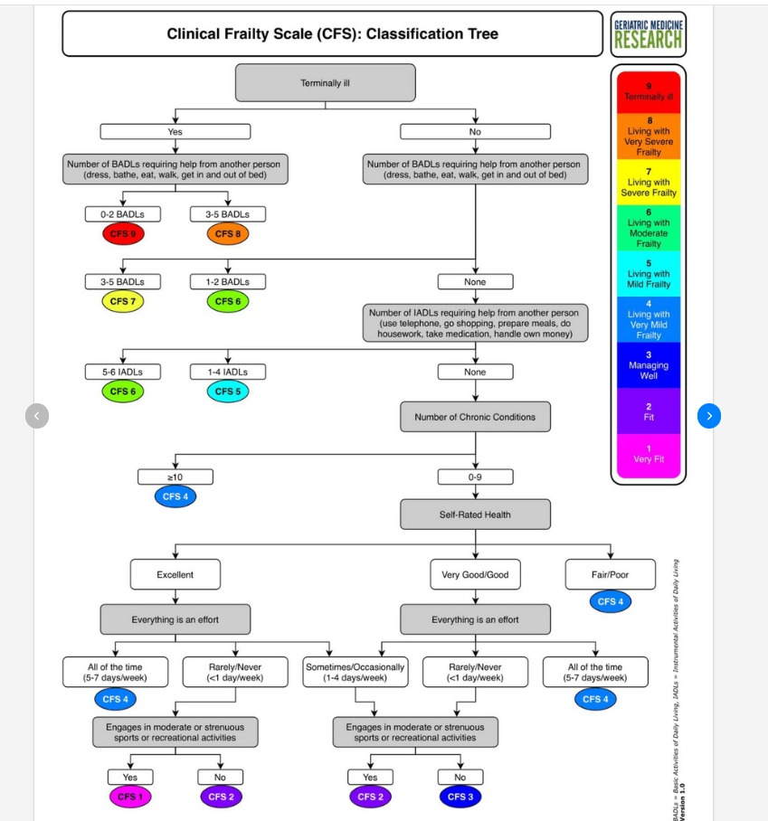
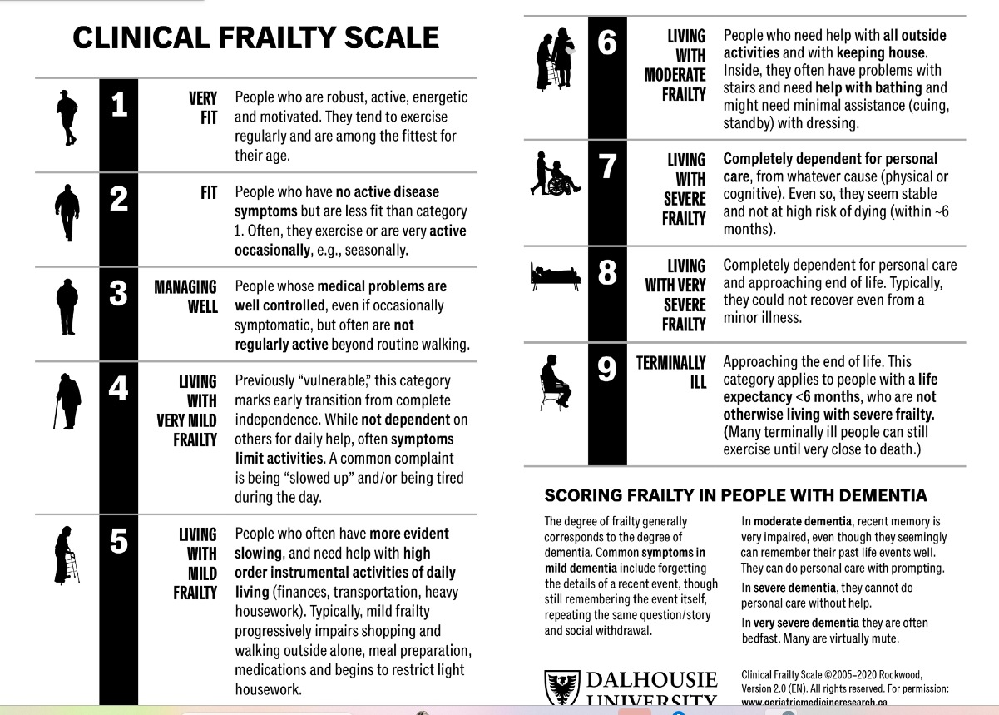

# Clinical Frailty Scale (CFS) Calculation Engine


This project implements a Python-based engine to automatically calculate the Clinical Frailty Scale (CFS) for patients. It processes patient assessment and diagnosis data to produce a CFS score from 1 to 9 based on a hard-coded clinical decision tree.

***

## 📋 Table of Contents
- [Visual Overview](#visual-overview)
- [Prerequisites](#prerequisites)
- [How to Run](#how-to-run)
- [File Structure](#file-structure)
- [How It Works](#how-it-works)
- [Implemented Logic Flowchart](#implemented-logic-flowchart)
- [Clinical Frailty Scale Descriptions](#clinical-frailty-scale-cfs-descriptions)
- [License](#license)

***

## 🖼️ Visual Overview

Below is the official CFS classification tree and an explanation of the levels of frailty.

| CFS Classification Tree | CFS Explanation |
| :---: | :---: |
|  |  |

***

## 🛠️ Prerequisites

Before running the script, ensure you have the required Python libraries installed. You can install them using pip:

```bash
pip install pandas tqdm
```

***

## 🚀 How to Run

1.  Make sure your input data, `Cleaned_Assessment.csv` and `Diagnosis.csv`, are located in the `INPUT/` directory.
2.  Run the main script from your terminal:

```bash
python cfs_calculator.py
```

The script will process the patients and save the results in the `OUTPUT/` directory.

***

## 📂 File Structure

-   `cfs_calculator.py`: The main script containing all the logic for calculation, data mapping, and the decision tree.
-   `INPUT/`: Directory for the input data files.
-   `OUTPUT/`: Directory where the result file (`CFS_Results.csv`) is saved.
-   `Archive/`: Contains older versions of the rule engine and tests.

***

## ⚙️ How It Works

The calculation logic is contained within the `cfs_calculator.py` script and is built around the `CFSCalculator` class.

1.  **Data Mappings (`FactMappings` class)**: All mappings from the raw data to standardized "facts" are stored in this static class.
2.  **Decision Tree**: The core logic is a tree built from `DecisionNode` and `ResultNode` objects. Each `DecisionNode` represents a question (e.g., "Is `badl_count >= 3`?"), and each `ResultNode` represents a final CFS score.
3.  **Execution Flow**:
    *   The script loads data from `INPUT/` using `pandas`.
    *   It iterates through each patient, generating a dictionary of "facts".
    *   The `evaluate()` method traverses the decision tree based on these facts until it reaches a `ResultNode`.
4.  **Output**: The results, including the patient ID, CFS score, and the facts used, are saved to `OUTPUT/CFS_Results.csv`.

***

## 📊 Implemented Logic Flowchart

The `cfs_calculator.py` script can generate a Mermaid flowchart that visualizes the exact decision tree implemented in the code. This ensures the documentation is always in sync with the logic.

<details>
<summary>Click to view the live-generated logic flowchart</summary>

```mermaid
flowchart TD
    N0{is_terminally_ill equal True}
    N0 -- Yes --> N1["CFS 9: Terminally Ill"]
    N0 -- No --> N2{badl_count greater_than_or_equal 3}
    N2 -- Yes --> N3{badl_count in_range [3, 5]}
    N3 -- Yes --> N4["CFS 8: Living with Very Severe Frailty, Totally Dependent"]
    N3 -- No --> N5["CFS 7: Living with Severe Frailty"]
    N2 -- No --> N6{badl_count in_range [1, 2]}
    N6 -- Yes --> N7["CFS 6: Living with Moderate Frailty"]
    N6 -- No --> N8{iadl_count greater_than_or_equal 1}
    N8 -- Yes --> N9{iadl_count in_range [1, 4]}
    N9 -- Yes --> N10["CFS 5: Living with Mild Frailty"]
    N9 -- No --> N11["CFS 6: Living with Moderate Frailty"]
    N8 -- No --> N12{chronic_condition_count greater_than_or_equal 10}
    N12 -- Yes --> N13["CFS 4: Living with Very Mild Frailty"]
    N12 -- No --> N14{self_rated_health in ['Fair', 'Poor']}
    N14 -- Yes --> N15["CFS 4: Living with Very Mild Frailty"]
    N14 -- No --> N16{effort_to_perform_tasks equal sometimes_occasionally}
    N16 -- Yes --> N17{engages_in_strenuous_activity equal False}
    N17 -- Yes --> N18["CFS 3: Managing Well"]
    N17 -- No --> N19["CFS 2: Fit"]
    N16 -- No --> N20{effort_to_perform_tasks equal rarely_never}
    N20 -- Yes --> N21{engages_in_strenuous_activity equal False}
    N21 -- Yes --> N22["CFS 2: Fit"]
    N21 -- No --> N23["CFS 1: Very Fit"]
    N20 -- No --> N24["CFS 4: Living with Very Mild Frailty"]
```

</details>

***

## 📖 Clinical Frailty Scale (CFS) Descriptions

This section provides the official descriptions for each level of the Clinical Frailty Scale.

### 1. Very Fit
People who are robust, active, energetic and motivated. They tend to exercise regularly and are among the fittest for their age.

### 2. Fit
People who have no active disease symptoms but are less fit than category 1. Often, they exercise or are very active occasionally, e.g., seasonally.

### 3. Managing Well
People whose medical problems are well controlled, even if occasionally symptomatic, but often are not regularly active beyond routine walking.

### 4. Living with Very Mild Frailty
Previously "vulnerable," this category marks early transition from complete independence. While not dependent on others for daily help, often symptoms limit activities. A common complaint is being "slowed up" and/or being tired during the day.

### 5. Living with Mild Frailty
People who often have more evident slowing, and need help with high order instrumental activities of daily living (finances, transportation, heavy housework).

### 6. Living with Moderate Frailty
People who need help with all outside activities and with keeping house. Inside, they often have problems with stairs and need help with bathing and might need minimal assistance with dressing.

### 7. Living with Severe Frailty
Completely dependent for personal care, from whatever cause (physical or cognitive). Even so, they seem stable and not at high risk of dying (within ~6 months).

### 8. Living with Very Severe Frailty
Completely dependent for personal care and approaching end of life. Typically, they could not recover even from a minor illness.

### 9. Terminally Ill
Approaching the end of life. This category applies to people with a life expectancy < 6 months, who are not otherwise living with severe frailty.

> *Clinical Frailty Scale @2005-2020 Rockwood, Version 2.0 (EN). All rights reserved. For permission: www.geriatricmedicineresearch.ca*

***

## 📜 License

This project is licensed under the MIT License. See the [LICENSE](LICENSE) file for details.
